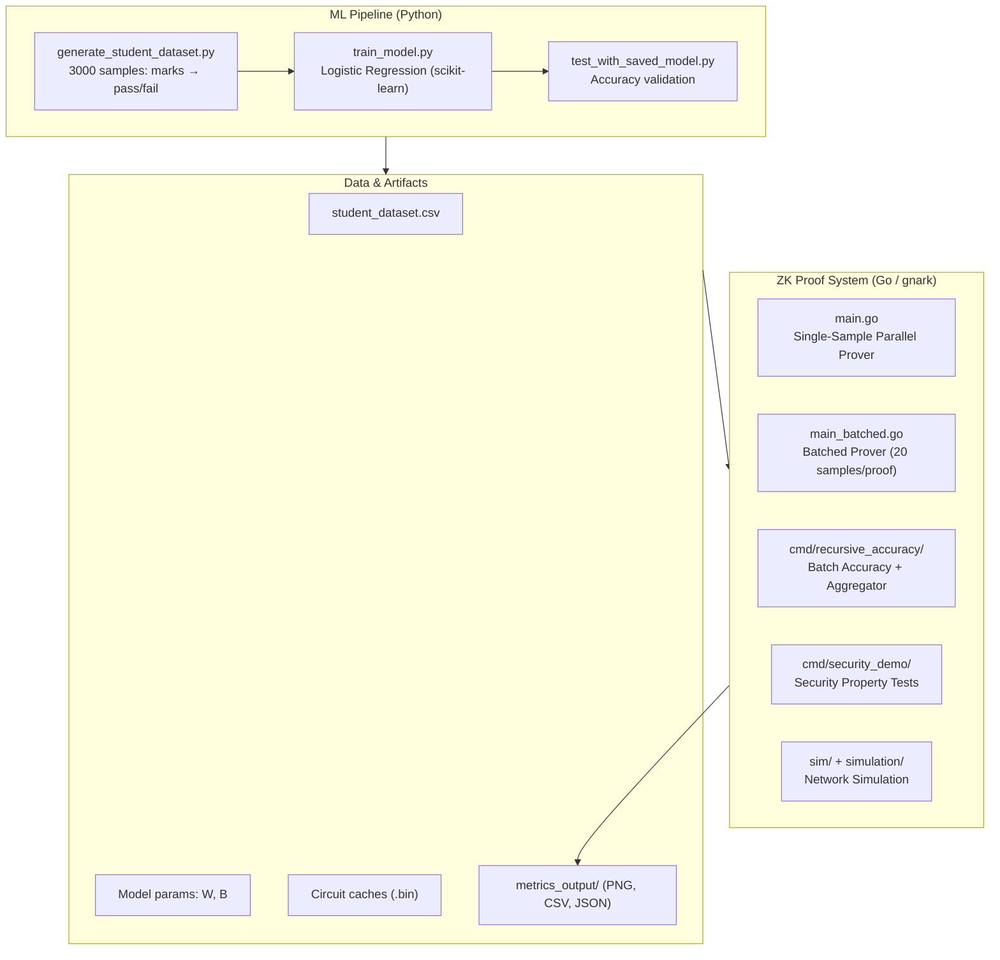
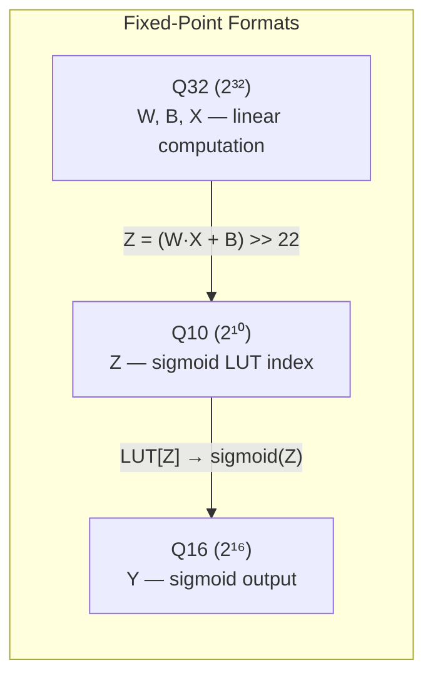
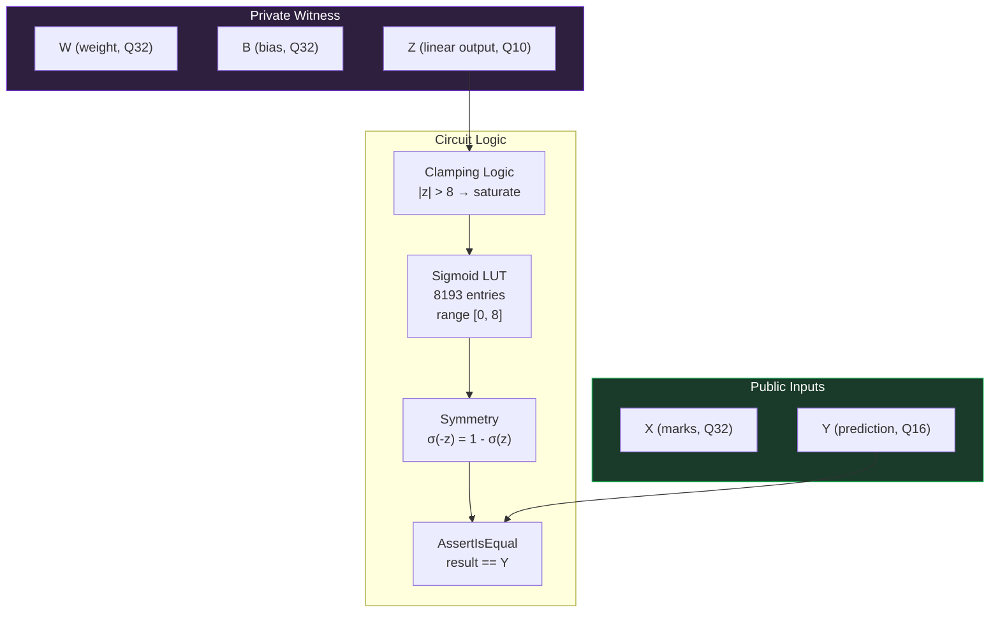
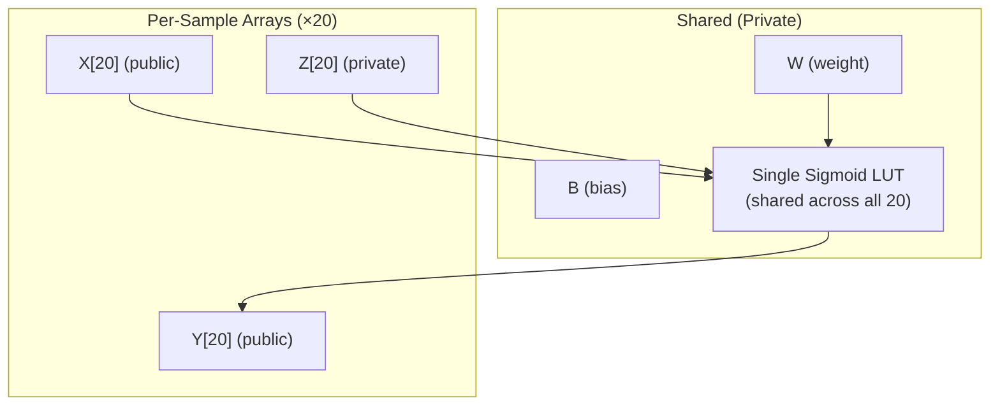
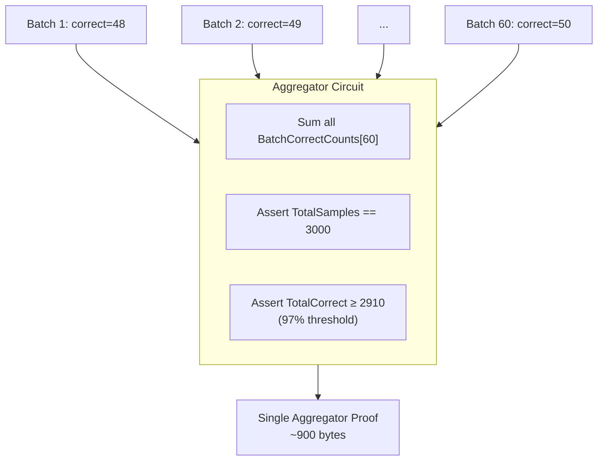
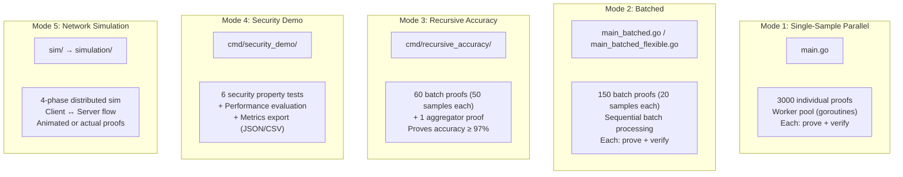
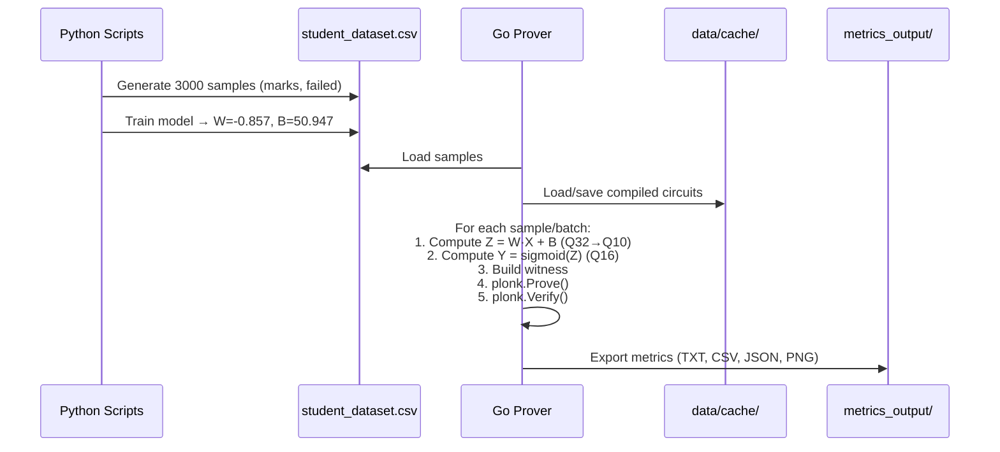
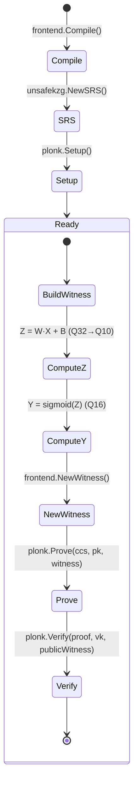
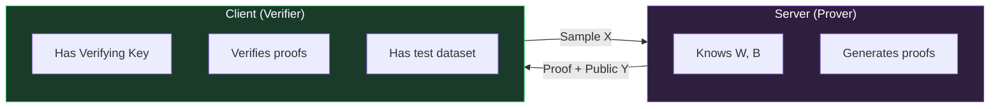
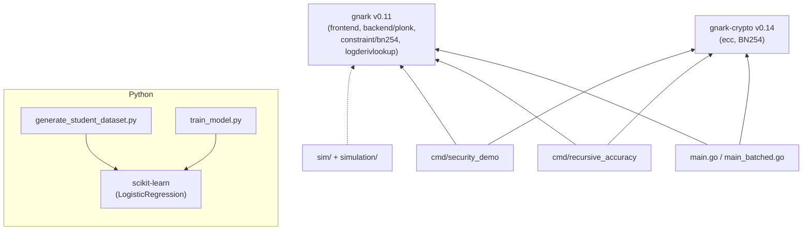

# ZKLR — Detailed System Architecture

> **Zero-Knowledge Logistic Regression**: Privacy-preserving ML inference using PLONK ZK-SNARKs on BN254.

---

## 1. High-Level Overview

ZKLR proves that a logistic regression model (`Y = σ(W·X + B)`) was executed correctly **without revealing the model weights (W, B)** to the verifier/client. The system uses [gnark](https://github.com/ConsenSys/gnark) v0.11 with PLONK over the BN254 elliptic curve.



---

## 2. Core Cryptographic Stack

| Layer | Technology | Details |
|-------|-----------|---------|
| **Proof System** | PLONK | Universal zkSNARK with polynomial commitments |
| **Elliptic Curve** | BN254 | 128-bit security, ~254-bit scalar field |
| **Commitment** | KZG (Kate) | Polynomial commitment scheme |
| **Constraint System** | SparseR1CS | gnark's optimized PLONK constraint format |
| **Lookup Tables** | Log-derivative | Efficient table lookups for sigmoid |
| **Library** | gnark v0.11 + gnark-crypto v0.14 | Consensys Go ZK framework |

### Trusted Setup

Currently uses `unsafekzg.NewSRS()` (deterministic, for development only). Production requires an MPC ceremony.

---

## 3. Fixed-Point Arithmetic System

All computations inside circuits use fixed-point integers:



| Format | Scale Factor | Precision | Used For |
|--------|-------------|-----------|----------|
| **Q32** | 2³² = 4,294,967,296 | ~9.3 decimal digits | Weight (W), Bias (B), Input (X) |
| **Q10** | 2¹⁰ = 1,024 | ~3 decimal digits | Sigmoid lookup index |
| **Q16** | 2¹⁶ = 65,536 | ~4.8 decimal digits | Sigmoid output / prediction |

**Conversion**: `Z_Q10 = Z_Q32 / 2^(32-10) = Z_Q32 >> 22`

---

## 4. Circuit Architecture

### 4.1 Single-Sample Circuit (`main.go` → `Circuit`)

The foundational circuit proving `Y = sigmoid(W·X + B)` for one sample.



**Constraint count**: ~170,000 (dominated by the log-derivative lookup table)

**Key design decision**: `Z = W·X + B` is pre-computed outside the circuit and passed as a private witness. This avoids division-by-negative issues in the finite field.

### 4.2 Sigmoid Lookup Table

```
Index i ∈ [0, 8192]
  → x = i / 2¹⁰           (float in [0, 8])
  → y = 1 / (1 + e⁻ˣ)     (sigmoid)
  → scaled = y × 2¹⁶       (Q16 integer)
  → table.Insert(scaled)
```

**Negative handling**: For `z < 0`, use the identity `σ(-z) = 1 - σ(|z|)`.

**Saturation**: If `|z| > 8`, output is clamped to 0 (negative) or 65,535 (positive).

### 4.3 Batch Circuit (`main_batched.go` → `BatchCircuit`)

Processes **20 samples** in a single proof by sharing one LUT across all samples.



**Key benefit**: The LUT is compiled once into the circuit, so batching amortizes the LUT overhead (~58K constraints) across 20 samples.

### 4.4 Batch Accuracy Circuit (`cmd/recursive_accuracy/` → `BatchAccuracyCircuit`)

Extends the batch circuit with **accuracy counting** — proves the sigmoid prediction AND compares it against actual labels.

| Field | Visibility | Type | Purpose |
|-------|-----------|------|---------|
| `W` | Private | Variable | Model weight |
| `B` | Private | Variable | Model bias |
| `X[50]` | Public | Array | Input features |
| `Z[50]` | Private | Array | Linear outputs |
| `Y[50]` | Public | Array | Sigmoid predictions |
| `ActualLabels[50]` | Public | Array | Ground truth labels |
| `CorrectCount` | Public | Variable | Number of correct predictions |

**Logic**: For each sample, it computes sigmoid, thresholds at 0.5 (Q16 = 32,768), compares predicted vs actual label, and increments `CorrectCount`. Finally asserts the claimed `CorrectCount` matches the circuit's computed value.

### 4.5 Aggregator Circuit (`AggregatorCircuit`)

The **top-level recursive proof** that aggregates batch results and enforces the accuracy threshold.



**Constraint count**: ~5,388 (lightweight — just integer sums and comparisons)

### 4.6 Security Demo Circuits (`cmd/security_demo/`)

Two circuits used for security property demonstrations:

1. **`Circuit`** (same as main) — used for correctness, tampered proof, tampered input tests
2. **`SimpleCircuit`** (`Y = X²`) — used for zero-knowledge, wrong witness, wrong VK tests

**Security tests performed**:
- ✅ **Completeness**: Honest prover succeeds
- ✅ **Soundness**: Tampered proofs/inputs rejected
- ✅ **Zero-Knowledge**: Proof reveals nothing about witness
- ✅ **Wrong Witness**: Invalid witness rejected
- ✅ **Wrong VK**: Cross-circuit verification fails

---

## 5. Execution Modes



### Mode 1: Single-Sample Parallel (`main.go`)

```
Setup → Compile Circuit → Generate SRS → PLONK Setup (PK, VK)
  ↓
Load 3000 samples → Create ProofTasks
  ↓
Spawn worker goroutines (1 currently, designed for N CPUs)
  ↓
Each worker: compute witness → plonk.Prove → plonk.Verify
  ↓
Collect results → Export metrics
```

**Caching**: Circuit (CCS), proving key (PK), and verifying key (VK) are serialized to `data/cache/` for reuse.

### Mode 2: Batched (`main_batched.go`)

Same pipeline but groups 20 samples into a single `BatchCircuit` proof. Padding is used when total samples aren't divisible by batch size.

### Mode 3: Recursive Accuracy (`cmd/recursive_accuracy/`)

```
Phase 1: Compile BatchAccuracyCircuit + AggregatorCircuit
Phase 2: Generate 60 batch proofs (50 samples each), collecting CorrectCount
Phase 3: Feed all 60 CorrectCounts into AggregatorCircuit, prove ≥ 97%
Phase 4: Verify the single aggregator proof
```

---

## 6. Data Flow



### ML Model Parameters

Hardcoded in Go after Python training:

| Parameter | Value | Description |
|-----------|-------|-------------|
| **W** (weight) | -0.85735312 | Logistic regression coefficient |
| **B** (bias) | 50.94705066 | Logistic regression intercept |
| **Decision boundary** | ~59.4 marks | Students below this score → fail |

---

## 7. Project Directory Map

```
BTP_Project/
├── main.go                         # Mode 1: Single-sample parallel prover (645 lines)
├── main_batched.go                 # Mode 2: Batched prover, BatchSize=20 (450 lines)
├── main_batched_flexible.go        # Mode 2 variant (identical to main_batched.go)
│
├── cmd/
│   ├── recursive_accuracy/
│   │   └── main.go                 # Mode 3: BatchAccuracy(50) + Aggregator(60) (459 lines)
│   └── security_demo/
│       ├── main.go                 # Mode 4: 6 security tests + perf eval (1365 lines)
│       └── export.go               # Metrics export: JSON, CSV, plot scripts (913 lines)
│
├── sim/
│   └── main.go                     # Mode 5 entry: --animated or actual proofs (34 lines)
├── simulation/
│   └── network.go                  # Mode 5: 4-phase distributed simulation (164 lines)
│
├── lib/
│   └── version.go                  # Project metadata: Name="ZKLR", Version="0.1.0"
│
├── scripts/
│   ├── generate_student_dataset.py # Generates labeled student data (162 lines)
│   ├── train_model.py              # Trains logistic regression model (82 lines)
│   └── test_with_saved_model.py    # Validates model against dataset (134 lines)
│
├── data/
│   ├── student_dataset.csv         # 3000 rows: marks, failed (0 or 1)
│   ├── student_dataset_test.csv    # Test split
│   ├── cache/                      # Compiled circuits, keys, metrics
│   └── README.md                   # Data layout documentation
│
├── metrics_output/                 # Generated visualizations and analysis
│   ├── *.png                       # Benchmark charts (7+ plots)
│   ├── *.csv                       # Raw metric data
│   ├── *.json                      # Full analysis data
│   ├── metrics_collect*.py         # Metric collection scripts
│   └── plot_*.py                   # Visualization scripts
│
├── docs/
│   └── PROJECT_DOCUMENTATION.md    # Project documentation
│
├── go.mod                          # Module: github.com/santhoshcheemala/ZKLR
├── go.sum
├── updated_results_chapter.tex     # LaTeX results chapter
└── README.md                       # Project overview and usage guide
```

---

## 8. Proof Lifecycle (Detailed)



### Step-by-step for a single sample (marks=75):

1. **Scale input**: `X = 75 × 2³² = 322,122,547,200`
2. **Linear computation**: `Z_Q32 = W_Q32 × X_Q32 / 2³² + B_Q32`
3. **Rescale**: `Z_Q10 = Z_Q32 / 2²² ≈ -13,352` (negative → student likely passes)
4. **Sigmoid LUT lookup**: Index `|Z_Q10|`, apply symmetry for negative Z
5. **Output**: `Y_Q16 ≈ 65535` (probability ≈ 1.0 → pass)
6. **Circuit**: Verifies the above computation without revealing W or B

---

## 9. Security Model



| Property | Guarantee |
|----------|-----------|
| **Completeness** | Honest prover with correct computation always produces valid proof |
| **Soundness** | Prover cannot create valid proof for incorrect computation |
| **Zero-Knowledge** | Proof reveals nothing about W, B, or Z |
| **Accuracy Threshold** | Aggregator proof guarantees ≥97% accuracy on full dataset |

---

## 10. Dependencies



### Go Dependencies (from `go.mod`)

| Package | Version | Purpose |
|---------|---------|---------|
| `gnark` | v0.11.0 | ZK-SNARK framework (circuits, PLONK prover/verifier) |
| `gnark-crypto` | v0.14.0 | Cryptographic primitives (BN254, KZG, hashing) |

### Python Dependencies

| Package | Purpose |
|---------|---------|
| `scikit-learn` | Logistic regression training |
| `numpy` | Numerical computation |

---

## 11. Performance Characteristics

| Metric | Single-Sample | Batched (20) | Recursive (50+Agg) |
|--------|--------------|-------------|-------------------|
| **Constraints** | ~170K | ~170K × 20 amortized | ~1.6M per batch + 5.4K agg |
| **Proofs for 3000 samples** | 3000 | 150 | 60 + 1 |
| **Proof size** | ~900 bytes each | ~900 bytes each | ~900 bytes (aggregator) |
| **Verification** | ~1.3ms each | ~1.3ms each | ~1.3ms (aggregator only) |
| **Key advantage** | Simple, parallelizable | Amortized LUT cost | Single proof for accuracy |

---

*Generated from codebase analysis on 2026-02-28*
